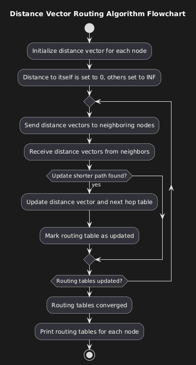

# Distance Vector Routing Algorithm

## Overview
This project implements the **Distance Vector Routing Algorithm** in **C++** to calculate the routing tables for each node in a given subnet topology. The implementation simulates how nodes in a network exchange information to find optimal routes, based on the **Bellman-Ford principle**. The program converges once all nodes in the network have consistent routing tables, providing an efficient route to each destination.

## Problem Definition
The primary objective is to implement a **Distance Vector Routing Algorithm** that calculates and displays the routing tables for all nodes in a subnet. The subnet topology is represented as a matrix of distances between nodes, and the goal is to simulate how nodes in a network update their routing tables by sharing distance information with neighboring nodes.

## Features
- Implementation of the **Bellman-Ford-based Distance Vector Routing Algorithm**.
- Calculation of routing tables for all nodes, showing the destination node, cost to reach that destination, and the next hop.
- Example demonstration with a sample network topology to illustrate how the algorithm works.

## Algorithm Documentation

### 1. Problem Definition
The goal is to create a program that calculates routing tables for each node using the **Distance Vector Routing Algorithm**. This approach should consider all nodes and paths, updating the routing tables iteratively to optimize routes until convergence.

### 2. Algorithm Overview
- Each node starts by initializing the distance to itself as `0` and to all other nodes as **infinity (INF)**.
- Routing tables are established based on the direct edges defined by the subnet graph.
- Nodes exchange distance vectors with their neighbors.
- Routing tables are updated whenever a shorter path is found, following the **Bellman-Ford principle**.
- The process continues iteratively until no further updates occur, indicating that routing tables have converged.

### 3. Node Representation
- Each node maintains two tables:
  - **Distance Vector Table**: Stores the current estimated cost to reach each destination.
  - **Next Hop Table**: Stores the next hop node used to reach each destination.

### 4. Code Components
- The `Node` class contains data structures for each node's distance vector and next hop information.
- The `distanceVectorRouting` function manages the initialization, updating, and convergence of routing tables.
- The `main` function defines the network topology as a distance matrix and invokes the routing algorithm.

### 5. Sample Output
- The routing tables for each node are displayed after the convergence.
- Each table includes:
  - **Destination Node**
  - **Cost to Reach Destination**
  - **Next Hop Node**

## Example Network Topology
The program includes an example subnet topology represented as follows:
```
     (1)
    / | \
  5 /  |1  \ 3
  /   |   \
(0)---(3)----(2)
     2
```
The graph is represented in code as a distance matrix:
```cpp
vector<vector<int>> graph = {
    {0, 5, INF, 1},
    {5, 0, 3, INF},
    {INF, 3, 0, 2},
    {1, INF, 2, 0}};
```
The example illustrates a simple network of four nodes with specified distances between them. The routing tables for each node are computed and printed.

## Algorithm Flowchart
To better understand the flow of the algorithm, here is a flowchart that illustrates the iterative process of the Distance Vector Routing Algorithm:



## Usage

### Prerequisites
To compile and run the C++ program, you will need:
- A C++ compiler (e.g., `g++`).
- A terminal to run the compiled executable.

### Compilation
To compile the program, run the following command in your terminal:
```sh
g++ distance_vector.cpp -o distance_vector
```

### Running the Program
After compiling, run the executable as follows:
```sh
./distance_vector
```
The program will output the routing tables for each node in the subnet.

## Sample Output
The program prints the routing table for each node, displaying the destination, cost, and next hop:
```
Routing table for Node 1:
Destination	Cost	Next Hop
1		0	1
2		5	2
3		4	4
4		1	4

...
```

## How It Works
- **Initialization**: Each node's distance to itself is set to `0`, and the distance to all other nodes is set to **infinity**.
- **Sharing Distance Vectors**: Nodes exchange distance vectors with their neighbors.
- **Updating Tables**: Nodes update their routing tables based on received information, looking for shorter paths.
- **Convergence**: The algorithm terminates when all nodes' distance vectors stabilize, meaning no further updates are needed.

## Limitations
- The program is not optimized for very large networks, as the triple-nested loop may introduce significant computational overhead.
- **Distance loops** are handled by checking for `INF` (unreachable nodes), but the graph must be consistent to prevent undefined behavior.

## Future Improvements
- Implementing link cost updates dynamically to reflect real-time network changes.
- Optimizing the algorithm for large-scale networks by using different data structures.
- Adding error handling to ensure input consistency.

## License
This project is licensed under the MIT License. Feel free to use, modify, and distribute it as per the license terms.

## Contributions
Contributions are welcome! If you find issues or have suggestions for improvements, please open an issue or create a pull request.

## Contact
If you have any questions, feel free to reach out:
- **Author**: Adam Morehouse
- **Email**: k2aam@k2aam.us


